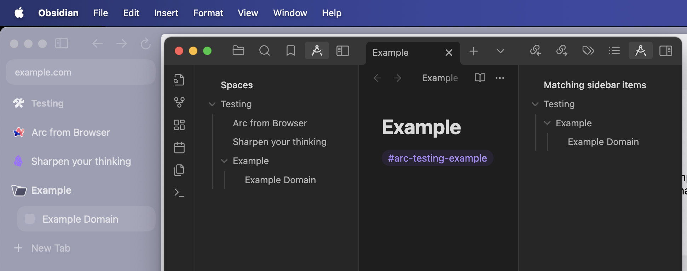

# Obsidian Arc Sidebar Plugin

An [Obsidian](https://obsidian.md) plugin that lets you access contents of your [Arc Browser](https://arc.net) sidebar and connect them to notes in your vault.

How does it work?
- Reads contents of Arc sidebar and displays it in Obsidian
- Allows you to connect specific parts of Arc sidebar with your notes using tags (i.e. `#arc-space-folder-item`)
- Reloads each time you focus back on Obsidian to keep you up to date
- Sidebar links can be opened directly from Obsidian
- Plugin only reads from Arc sidebar JSON file, and does not modify it

Features / TODO
-

- [x] Adds outline view in left sidebar that displays full contents of Arc sidebar
- [x] Adds note view in right sidebar that displays filtered contents of Arc sidebar
- [x] Adds command palette actions to open each view
- [x] Allows to filter contents in note view by adding tags to note using format:
  - `#arc-space` - will display all links from given space
  - `#arc-space-folder` - display all links from folder in space, you can nest folders by adding more `-folder`
  - `#arc-space-folder-item` - will display specific item only (names in tags contains only alphanumeric characters)
- [x] Open link when clicking on item name
- [ ] Add folding and unfolding for spaces and folders
- [ ] Add expand/collapse option to both views
- [ ] Add search/filter to both views
- [ ] Add sorting options to both views
- [ ] Find out wheather it's possible for links to open directly in their respective space/folder location in Arc
- [ ] Display favicons next to items (from Arc favicon cache)
- [ ] Optimise reloading / add some caching / checking for changes to reduce reloading
- [ ] Improve note view refresh rate / response to tag changes
- [ ] Idea: allow to somehow permanently copy/store sidebar items in note

Installation
-

Plugin is not yet released to community, because it's barely usable, but if you want to install anyway just download latest release and drop it into your vaults plugin folder.

Limitations
- 

- Don't know if it works on Windows. It's possible to change sidebar JSON file location in plugin settings, but I don't know if JSON structure is the same.
- Only links from Arc sidebar are supported for now. Other types of items (i.e. easels) will display empty item.
- When you add tags to note, updating view on the right is a bit wonky (sometimes instant, sometimes not).

Contributing
-

If you have any ideas, suggestions, or have found any bugs please [open an issue](https://github.com/niczyja/obsidian-arc-sidebar/issues).
